<p align= center>

</p>


**<p style="text-align: center;">UNIVERSIDAD PERUANA DE CIENCIAS APLICADAS</p>**
**<p style="text-align: center;">CARRERA:</p>**
*<p style="text-align: center;">Ingeniería de Software</p>*
**<p style="text-align: center;">CURSO:</p>**
*<p style="text-align: center;">Desarrollo de Aplicaciones Open Source</p>*
**<p style="text-align: center;">SECCIÓN:</p>**
*<p style="text-align: center;">WX52</p>*
**<p style="text-align: center;">FINAL PROYECT REPORT - TB1</p>**
**<p style="text-align: center;">STARTUP:</p>**
**<p style="text-align: center;"></p>**
**<p style="text-align: center;">DOCENTE:</p>**
*<p style="text-align: center;">Juan Antonio Flores Moroco</p>*
**<p style="text-align: center;">GRUPO 02</p>**
**<p style="text-align: center;">AUTORES:</p>**
*<p style="text-align: center;">Doig Apostol, Andrés - U201712256</p>*
*<p style="text-align: center;">Llatas Flores, Enrique Aldhair - U20201F172</p>*
*<p style="text-align: center;">Carrasco Hernández, Florentino Josue - U202020727</p>*
*<p style="text-align: center;">Cueva Elera, Erick Armando - U201910151</p>*
*<p style="text-align: center;">Zamora Rivera, Ismael Sebastián - U202116671</p>*

<br>

*<p style="text-align: center;">Lima - Septiembre 2023</p>*

<div style="page-break-after: always;"></div>


# Registro de Versiones del Informe


<p style="text-align: center;">06.09.23 - TB1</p>


# Student Outcome


<div style="page-break-after: always;"></div>


Capítulo 1: Introducción

1.1. Startup Profile <br>
1.1.1. Descripción de la Startup <br>
1.1.2. Perfiles de integrantes del equipo <br>
1.2. Solution Profile <br>
1.2.1. Antecedentes y problemática <br>
1.2.2. Lean UX Process <br>
1.2.2.1. Lean UX Problem Statements <br>
1.2.2.2. Lean UX Assumptions <br>
1.2.2.3. Lean UX Hypothesis Statements <br>
1.2.2.4. Lean UX Canvas <br>
1.3. Segmentos objetivo <br>

Capítulo 2: Requierements Elicitation & Analysis

2.1. Competidores <br>
2.1.1. Análisis competitivo <br>
2.1.2. Estrategias y tácticas frente a competidores <br>
2.2. Entrevistas <br>
2.2.1. Diseño de entrevistas <br>
2.2.2. Registro de entrevistas <br>
2.2.3. Análisis de entrevistas <br>
2.3. Needfinding <br>
2.3.1. User Personas <br>
2.3.2. User Tast Matrix <br>
2.3.3. User Journey Mapping <br>
2.3.4. Empathy Mapping <br>
2.3.5. As-Is Scenario Mapping <br>

Capítulo 3: Requirements Specification

3.1. To-Be Scneario Mapping <br>
3.2. User Stories <br>
3.3. Impact Mapping <br>
3.4. Product Backlog <br>

Capítulo 4: Product Design

4.1. Style Guidelines <br>
4.1.1. General Style Guidelines <br>
4.1.2. Web Style Guidelines <br>
4.2. Information Architechture <br>
4.2.1. Organization Systems <br>
4.2.2. Labeling Systems <br>
4.2.3. SEO Tags and Meta Tags <br>
4.2.4. Searching Systems <br>
4.2.5. Navigation Systems <br>
4.3. Landing Page UI Design <br>
4.3.1. Landing Page Wireframe <br>
4.3.2. Landing Page Mock-Up <br>
4.4. Web Applications UX/UI Design <br>
4.4.1. Web Applications Wireframes <br>
4.4.2. Web Applications Wireflow Diagrams <br>
4.4.3. Web Applications Mock-Ups <br>
4.4.4. Web Applications User Flow Diagrams <br>
4.5. Web Applications Prototyping <br>
4.6. Domain-Driven Software Architecture <br>
4.6.1. Software Architecture Context Diagram <br>
4.6.2. Software Architecture Container Diagrams <br>
4.6.3. Software Architecture Components Diagrams <br>
4.7. Software Object-Oriented Design <br>
4.7.1. Class Diagrams <br>
4.7.2. Class Dictionary <br>
4.8. Database Design <br>
4.8.1. Database Diagram <br>

Capítulo 5: Product Implementation, Validation & Deployment

5.1. Software Configuration Management <br>
5.1.1. Software Development Environment Configuration <br>
5.1.2. Source Code Management <br>
5.1.3. Source Code Style Guide & Conventions <br>
5.1.4. Software Deployment Configuration <br>
5.2. Landing Page, Services & Applications Implementation <br>
5.2.1. Sprint 1 <br>
5.2.1.1. Sprint Planning 1 <br>
5.2.1.2. Sprint Backlog 1 <br>
5.2.1.3. Development Evidence for Spring Review <br>
5.2.1.4. Testing Suite Evidence for Sprint Review <br>
5.2.1.5. Execution Evidence for Sprint Review <br>
5.2.1.6. Services Documentation Evidence for Sprint Review <br>
5.2.1.7. Software Deployment Evidence for Sprint Review <br>
5.2.1.8. Team Collaboration Insights during Sprint <br>
5.3. Validation Interviews <br>
5.3.1. Diseño de Entrevistas <br>
5.3.2. Registro de Entrevistas <br>
5.3.3. Evaluaciones según heurísticas <br>
5.4. Video About-the-Product <br>

Conclusiones

Conclusiones y recomendaciones <br>
Video About-the-Team <br>

Bibliografía

Anexos


<div style="page-break-after: always;"></div>

# Capítulo 1: Introducción

## 1.1. Startup Profile
### 1.1.1. Descripción de la Startup

Hoy en día estamos pasando por un crecimiento de herramientas digitales muy drástico, las cuales mejoran el producto, servicio, etc. que ofrecen diversas empresas en el ámbito industrial. Muchas veces son sistemas para la mejorar la eficiencia en procesos internos, pero también se usan para mejorar la experiencia de sus clientes.

Para esto, nuestro equipo decidió crear una Startup de desarrollo de estas herramientas para empresas industriales, llamada Construction Systems. La propuesta de Construction Systems consiste en desarrollar una aplicación web llamada Constech.

Misión y Visión de la Startup

Misión: Ayudar a los empresarios en el ámbito industrial en poder brindar un excelente servicio y comodidades a sus clientes.

Visión: Ser líderes en el mercado peruano, en herramientas tecnológicas para la industria.
### 1.1.2. Perfiles de integrantes del equipo

Florentino Josue Carrasco Hernandez (U202020727)
Estudiante de Ingeniería de Software en la Universidad Peruana de Ciencias Aplicadas. Responsable, proactivo, comunicativo, tolerante, empático y orientado a resultados. Tengo conocimientos en desarrollo web HTML, CSS, JavaScript.
<p align= left>

</p>

Ismael Sebastian Zamora Rivera (U202116671) Estudiante de Ingeniería de Software en la Universidad Peruana de Ciencias Aplicadas. Sociable, empático y ordenado. Tengo conocimientos en desarrollo web.
<p align= left>

</p>

## 1.2. Solution Profile

Constech ayudará a las empresas o ingenieros de construcción, ya sea civil, naval, software u otro tipo de construcción mantener actualizados a sus clientes sobre contratos u obras de construcción realizadas por las diversas empresas.

Además, los clientes de estas empresas podrán realizar consultas, recomendaciones de mejoras u otros tipos de observaciones durante los avances de los trabajos. Como funcionalidad adicional, los clientes también podrán ver los gastos en materiales y el uso de estos.
### 1.2.1. Antecedentes y problemática

Las 5 “W” y 2 “H”

WHAT: El problema que ocurren en las diferentes empresas de construcción, es que los clientes no siempre están actualizados con respecto al avance de alguna obra de construcción u otro tipo de servicio industrial.

WHEN: Esto ocurre cuando los ingenieros no se organizan entre ellos para poder dar constantes reportes de avances a sus clientes. Además, a veces los clientes no pueden ir en ese instante al lugar en el cual se está construyendo por diferentes razones.

WHERE: El problema ocurre en todas las empresas de construcción, ya sea civil, naval u otro tipo de trabajos industriales en el Perú.

WHO: Todas empresas dedicadas a la construcción u otro servicio de esta índole e ingenieros FreeLancer, que quieran optimizar y mejorar la comunicación de avances de los proyectos con sus clientes.

WHY: Muchas veces hay mal entendidos u otro tipo de problemas que interfieren con la comunicación directa y clara entre los encargados de los proyectos y sus clientes que quieren estar siempre actualizados del avance y otras informaciones importantes con respecto a estos.

HOW: Esto lo podremos solucionar con nuestra aplicación web, en la cual los encargados pondrán información en tiempo real sobre los proyectos y los clientes pueden ingresar a visualizar todo en el momento que deseen, sin necesidad de hacer citas de visitas o reuniones virtuales.

HOW MUCH: Esta aplicación tendrá un costo mensual, el cual será facturado a la empresa o al ingeniero con RUC para su comodidad contable. Si en caso la empresa o encargado de los proyectos necesite de servicios adicionales se podría llegar a un acuerdo según el contrato de alquiler del software.

### 1.2.2. Lean UX Process
#### 1.2.2.1. Lean UX Problem Statements

Las empresas encargadas de proyectos de construcción buscan una mayor gestión y control de esta, así una de las partes más importante en estos proyectos es la correcta gestión del Proyecto, ya que al realizarla de manera correcta estamos manteniendo el control de todas las acciones que se realiza. Esto nos da acceso a verificar que todas las acciones sucedan en tiempo y forma de acuerdo a la planeación establecida. De forma contrario si el Proyecto de gestiona de manera incorrecta el porcentaje de probabilidad que se presente un error aumenta. La tecnología hoy en día nos ha ayudado a facilitar nuestras vidas, simplificando muchas de las tareas que hacemos; en el ámbito de la construcción no es excepción, pues existen aplicaciones donde se puede gestionar el Proyecto, pero ninguna se enfoca tanto como en la cuestión estratégica, planificación como avance en poco tiempo del avance como la gestión de stock de materiales y herramientas.


Hemos identificado que hay un gran sector de ingenieros civiles, empresarios, como personas interesadas en el avance de la construcción de su casa, edificaciones y proyectos, los cuales quisieran mantenerse actualizados, ver el avance como mantenerse actualizado en el avance de la construcción, teniendo todas estas características en una página web accesible y fácil de usar y que por funciones como estas los usuarios estarían dispuestos a pagar.

Por lo que ¿Como podríamos brindar y lograr una experiencia a los ingenieros, empresarios y personas comunes a un acceso completa y con herramientas para poder gestionar sus proyectos?

#### 1.2.2.2. Lean UX Assumptions

Business Assumptions:

Como negocio y como startup se espera que podamos cumplir las siguientes metas:

Al finalizar el primer semestre de operaciones de la aplicación web se espera contar con al menos 500 profesionales registrados en nuestro Sistema.

Al finalizar el primer semestre de operaciones de la aplicación web se espera contar con al menos 100 empresarios activos que usen el software para su empresa pagando una suscripción anual.

Al término del primer año después del lanzamiento, se espera que la tendencia de uso de personas registradas vs personas activas en la aplicación se encuentre por encima del 30%.

Se espera que la aplicación web se vuelva financieramente rentable, con ingresos mayores de $10 000 mensuales durante los primeros dos años de funcionamiento.

Se espera que la tendencia de incremento de nuevos usuarios se mantenga en un 5% anualmente.

Se espera que el cambio de personas del paquete Free al Premium cubra una media de 15% del total de empresas que utilicen la aplicación frecuentemente.

Sobre la expansión, se espera que la aplicación tenga alcance internacional. De esta manera, se busca ingresar a otros países de habla hispana.

Users:

Nosotros asumimos que nuestros principales usuarios contaran con las siguientes características:

Ingenieros civiles, navales, etc: Personas interesadas en mantener actualizados a sus clientes de sus obras, y tener una vista global del avance y ver que falta comprar o por hacer.

Clientes empresarios: Personas interesadas en revisar o consultar estados de sus construcciones contratadas. (Grifos, edificios, muelles, embarcaciones, etc.)

User Outcomes:

Lo que el usuario desea lograr en la aplicación es:

Ingenieros, civiles, navales:

-Resolver el problema de la falta de una Plataforma de gestión de proyectos completa, donde se pueda ver el avance de la obra en corto tiempo

-Poder comunicarse con los trabajadores de una manera más rápida y poder ver el avance de su trabajo

- Visualizar en tiempo corto el stock de materiales y herramientas

Clientes empresarios:

- Acceso a tiempo real con estados actualizados de las construcciones.

-Poder comunicarse con los trabajadores de una manera más rápida y poder ver el avance de su trabajo

-Resolver el problema de tener todo el avance y gestión de los proyectos en una sola aplicación

Clientes naturales:

- Acceso a tiempo real con estados actualizados de las construcciones.

-Poder gestionar las construcciones de hogares más rápido y tener acceso rápido a su avance#

-Saber el stock de materiales como la finanza de estos.

Estimamos que nuestros clientes inicialmente serán personas de la capital del Perú entre los 20 a 35 años.

 La razón es que, hay muchos profesionales en carreras destinadas a la construcción donde desean tener una aplicación donde poder gestionar sus proyectos y que están siendo contratadas con empresas de prestigio y demanda, además de personas naturales que también adquieren un hogar o están edificando una.

Features:

En esta sección, se redactará las características de la Plataforma web que suponemos que nuestros usuarios necesitaran:

La aplicación permitirá agilizar y gestionar los proyectos a los usuarios.

Mediante la aplicación se podrá entablar una comunicación entre los miembros de un proyecto para poder visualizar avances y gestionar la proyección de este.

Todos los usuarios podrán tener acceso rápido al avance de su proyecto mediante imágenes como también tener todos sus archivos en la carpeta de su proyecto.

User Assumptions:

• ¿Quién es el usuario?

-Personas Jóvenes entre 20 a 35 años

-Plataforma web de gestión y avance de proyectos

-Equipo de trabajo general que se encarga de brindar soporte a la aplicación

• ¿Dónde encaja nuestro producto, en su trabajo o vida?

El producto encaja en el trabajo de los profesionales que brindan servicio para grandes empresas de construcciones y edificaciones de inmuebles

• ¿Qué problemas tiene nuestro producto?

Como cualquier producto, más allá del diseño y las funcionalidades, tenemos que darnos a conocer. Creemos que la mejor difusión es la que realizan los usuarios que disfrutaron nuestro producto.

• ¿Cuándo y cómo es nuestro producto usado?

Para arquitectos, ingenieros y personas interesadas en gestionar sus construcciones y tener control de gestión operativa, pueden hacer uso de este recurso mediante cualquier dispositivo que tenga acceso a internet.

• ¿Qué características son importantes?

Las características más importantes de un sitio web sobre gestión de proyectos y
control operativo es:

-Diseño: es imprescindible contar con un buen diseño si queremos captar clientes. 
-Usabilidad: un sitio de este tipo debe ser fácil de manejar.

-Personalización: creemos que cada usuario debería recibir noticias de su interés.

• ¿Como debe verse nuestro producto y comportarse?

Es importante que tenga una interfaz fácil de usar y completa al mismo tiempo. La interacción debe ser rápida e intuitiva. Como no es una aplicación que demande muchos recursos, no significa una molestia para el almacenamiento o la memoria, incluso de los dispositivos de “gama baja” o con pocas especificaciones técnicas.

Además, los colores utilizados no deben ser exageradamente fuertes o llamativos, puesto que esto sobrecargaría la app y podría generar un efecto negativo en la experiencia del usuario.


#### 1.2.2.3. Lean UX Hypothesis Statements
Dado los features antes presentados respecto a nuestros segmentos objetivos, procedemos con el planteamiento de hipótesis que validen si los supuestos antes planteados fueron correctos.

Business Hypothesis (hipótesis del negocio)

• Creemos que nuestros usuarios, como profesionales como arquitectos, ingenieros y empresarios encargados de constructoras e implementación de edificaciones grandes de inmuebles necesitan acceso a una plataforma para poder gestionar sus proyectos de una manera sencilla, teniendo el acceso a esta en cualquier hora y en cualquier lugar. Además de poder gestionar gastos como stock de materiales. Sabremos que esto es cierto cuando tengamos un 80% de reseñas positivas.

• Creemos que la buena interfaz, el manejo de proyectos y el poder tener un mejor control de las gestiones operativas serán el beneficio adicional que nos permitirá convertir nuestros usuarios en clientes. Sabremos que esto es cierto cuando dentro de 6 meses tengamos a 3000 usuarios que posean una suscripción.

• Creemos que nuestro mayor riesgo de negocio es que algunos usuarios no estén dispuestos a pagar por una suscripción, ya que, al ser una web nueva, los usuarios no se sienten 100% fiables de ella. Sabremos que esto es cierto cuando a los primeros meses de la aplicación, esta no alcance ni el 50% de las ganancias estimadas.

User Hypothesis (hipótesis de usuario)

1. Creemos que la creación de una plataforma en la que se pueda gestionar las construcciones y que te ayuden a tener un control sobre las acciones operativas y comunicación entre miembros de equipo, además de que puedan visualizar el avance de este en poco tiempo y en cualquier dispositivo con acceso a internet será de mucho beneficio. Sabremos que esto es cierto cuando más del 60% de los usuarios tengan una suscripción a la plataforma y den buenas reseñas acerca de esta.

2. Creemos que la implementación de las opciones para poder tener gestión sobre los materiales y stock será de gran beneficio para las empresas y profesionales. Sabremos esto sí es cierto cuando verifiquemos un aumento del 40% de los usuarios activos en los primeros meses.

3. Creemos que la integración de la proyección del avance en corto tiempo y visualización de ella como gestionarla de manera directa será muy beneficiosa. Sabremos que esto es cierto cuando verifiquemos que hay un aumento en la cantidad de reseñas positivas en un 50% dentro de un periodo de 6 meses.

<div style="page-break-after: always;"></div>

#### 1.2.2.4. Lean UX Canvas

El siguiente artefacto es la síntesis del Lean UX process realizado. Este sirve para tener una vista general de la situación de nuestros segmentos objetivos. 

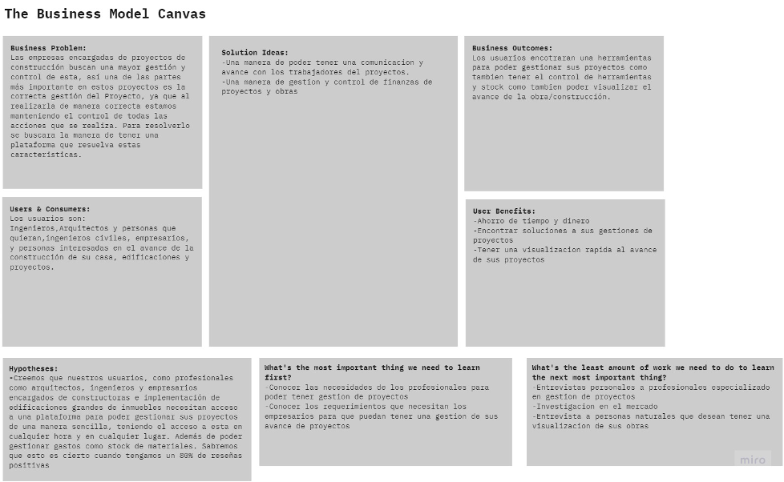

## 1.3. Segmentos objetivo


<div style="page-break-after: always;"></div>


# Capítulo 2: Requierements Elicitation & Analysis

## 2.1. Competidores

### 2.1.1. Análisis competitivo

### 2.1.2. Estrategias y tácticas frente a competidores

## 2.2. Entrevistas

### 2.2.1. Diseño de entrevistas

### 2.2.2. Registro de entrevistas

### 2.2.3. Análisis de entrevistas

## 2.3. Needfinding

### 2.3.1. User Personas

### 2.3.2. User Tast Matrix

### 2.3.3. User Journey Mapping

### 2.3.4. Empathy Mapping

### 2.3.5. As-Is Scenario Mapping


<div style="page-break-after: always;"></div>

# Capítulo 3: Requirements Specification

## 3.1. To-Be Scneario Mapping
<b>To-Be Scenario Mapping-Empresa</b><br>
<p align= left>

</p>
<b>To-Be Scenario Mapping-Cliente</b><br>
<p align= left>

</p>
## 3.2. User Stories
Hemos desarrollado los siguientes user stories para nuestra aplicación.

| Epic / User Story ID | Título                                                                        | Descripción                                                                                                                | Criterios de Aceptación                                                                                                                                                                                                                                                                                                                                                                                                                                                                                                                                                                                                                                                                                                                                                                                                                                                                                                                                                                                                                                                                                                                                                                                                                                                                                                    |   |
|----------------------|-------------------------------------------------------------------------------|----------------------------------------------------------------------------------------------------------------------------|----------------------------------------------------------------------------------------------------------------------------------------------------------------------------------------------------------------------------------------------------------------------------------------------------------------------------------------------------------------------------------------------------------------------------------------------------------------------------------------------------------------------------------------------------------------------------------------------------------------------------------------------------------------------------------------------------------------------------------------------------------------------------------------------------------------------------------------------------------------------------------------------------------------------------------------------------------------------------------------------------------------------------------------------------------------------------------------------------------------------------------------------------------------------------------------------------------------------------------------------------------------------------------------------------------------------------|---|
|     UC01             |     Registro Cliente                                                          |     Como usuario cliente   quiero registrarme en la aplicación para acceder a los servicios que ofrece   la aplicación     |     Escenario 1: El cliente introduce los datos requeridos.                                                                                     Dado que el cliente está en la pantalla de registro e introduce todos   los datos requeridos,                                                                                        Cuando presione el   botón "registrar”                                                                                     Entonces estará   registrado Y el sistema lo conducirá a la pantalla de inicio de sesión.            Escenario 2: El cliente no introduce los datos requeridos al   momento de registrarse.                                                                                     Dado que el   cliente está en la pantalla de registro                                                                                                     Y no introduce todos los datos requeridos,                                                                                Cuando   presione el botón "registrar",                                                                                      Entonces le devolverá el mensaje "debe llenar todos los   campos"                                 Y le señala al cliente los campos que debe   llenar.    |   |
|     UCD01            |     Registro como Empresa                                                     |     Como empresa quiero   registrarme para poder brindar mis servicios                                                     |     Escenario 1: El representante de la empresa, introduce los datos   requeridos.                    Dado que el representante está en la   pantalla de registro e introduce los datos requeridos,                  Cuando presione el   botón "registrar",                         Entonces el sistema   lo conducirá a la pantalla de inicio de sesión.                       Escenario 2: El representante de la empresa no introduce todos   los datos requeridos.           Dado que el   representante está en la pantalla de registro                                       Y no introduce todos   los datos requeridos,                Cuando presione el   botón "registrar",                         Entonces le devolverá   el mensaje "debe llenar todos los campos" y le señala los campos   que debe llenar.                                                                                                                                                                                                                                                                                                                                                                                                                                                                                                |   |
|     UC02             |     Observar el progreso   de mi proyecto                                     |     Como cliente quiero   saber cómo se encuentra el progreso del proyecto por el cual he pagado                           |     Escenario 1: Encuentra fotos del progreso del proyecto      Dado que el cliente   está en la sección de avances     Cuando oprima el   botón de “Avance de proyecto”     Entonces podrá ver   las fotos y la información sobre cómo está progresando su proyecto            Escenario 2: No hay fotos de avances     Dado que el cliente   se encuentre en la sección de avances     Cuando oprima el   botón "Avance de Proyecto",                         Entonces visualizará   el siguiente mensaje "Estamos trabajando en ello",                                                                                                                                                                                                                                                                                                                                                                                                                                                                                                                                                                                                                                                                                                                                                                                  |   |
|     UC03             |     Visualizar las   diferentes empresas que realizan diferentes proyectos    |     Como cliente quiero   ver varias opciones para poder realizar mi proyecto                                              |     Escenario 1: Encuentra una empresa con buenas características   para su proyecto     Dado que el cliente   se encuentra en la sección de inicio     Y visualiza las   diferentes empresas      Cuando haga click en   la empresa que llame su atención     Entonces podrá   observar la calificación, trabajos finalizados y comentarios acerca de esta   empresa.            Escenario 2: No hay empresas para el tipo de proyecto que desea      Dado que después de   realizar una búsqueda entre varias empresas presentadas en la pantalla de   inicio     Y ninguna empresa se   acomoda al proyecto que desea elaborar     Cuando haga click en   “Mensaje directo”     Entonces podrá tener   una comunicación directa con la empresa para poder acordar mejor los   parámetros y tener más información                                                                                                                                                                                                                                                                                                                                                                                                                                                                                                        |   |
|     UC04             |     Feedback sobre el   trabajo realizado                                     |     Como cliente quiero   dar una opinión acerca de cómo me siento con el trabajo realizado                                |     Escenario 1: El usuario brinda su opinión con éxito.      Dado que el cliente   recibió su proyecto finalizado     Y se logue en la aplicación   web, le saldrá una sección en donde observará el mensaje “Califícanos” con la   opción “ahora no” y “aceptar”      Cuando el usuario   haga click en “aceptar”      Entonces brinda su   opinión sobre el servicio brindado      Y visualizará el   mensaje “Comentario realizado”           Escenario 2: El usuario no escribe su opinión.      Dado que cliente   recibió su proyecto finalizado      Y se logue en la   aplicación web, le saldrá una sección en donde le saldrá el mensaje   “Califícanos” con la opción “ahora no” y “aceptar”      Cuando el usuario   haga click en “aceptar”     Y no escribe nada     Entonces visualizará   el mensaje “Por favor bríndanos tu opinión sobre el servicio brindado”                                                                                                                                                                                                                                                                                                                                                                                                                                          |   |
|     UCD02            |     Observar el feedback   de mi servicio brindado                            |     Como empresa quiero   observar los comentarios de mis clientes                                                         |     Escenario 1: Existen comentarios sobre el servicio que brindo.     Dado que el   representante de la empresa se encuentre en la sección principal de la   aplicación          Y presione el botón   configuración, aparecerá un menú desplegable,         Cuando seleccione la   opción feedback entonces podrá ver los comentarios de sus clientes.      Escenario 2: No existen comentarios sobre el servicio que   brindo.     Dado que el   representante del campo deportivo se encuentre en la sección principal de la   aplicación          Y presione el botón   configuración, aparecerá un menú desplegable,         Cuando seleccione la   opción feedback            Entonces observará el   mensaje “Aún no cuenta con comentarios”                                                                                                                                                                                                                                                                                                                                                                                                                                                                                                                                                                       |   |
|     UCD03            |     Ingresar datos de   servicio de la empresa                                |     Como empresa quiero   brindar más información sobre nosotros y certificaciones                                         |     Escenario 1: Ingresa sus datos con éxito.     Dado que me encuentre   en la sección de perfil de la empresa     Cuando presione el   botón “Agregar”     Y complete todos los   campos requeridos,     Entonces ingresará   más información sobre la empresa           Escenario 2: Ingresa imágenes sobre proyectos terminados.     Dado que me encuentre   en la sección de perfil de la empresa      Cuando presione el   botón “Agregar imágenes”     Y agregue las   imágenes deseadas     Entonces observará el   mensaje “¿Estás seguro de que desea agregar está imagen?”                                                                                                                                                                                                                                                                                                                                                                                                                                                                                                                                                                                                                                                                                                                                      |   |
|     UC05             |     Ver el estado del   material                                              |     Como cliente quiero   cambiar el tipo de material en construcción                                                      |     Escenario 1: Ingresa a cambiar el tipo de material.     Dado que el cliente   desea cambiar el material del suelo de su proyecto     Cuando ingrese a la   sección de sus proyectos y seleccione materiales     Entonces le saldrá la   información de los materiales con los que se está construyendo su proyecto y   si desea cambiarlos.             Escenario 2: Desea cambiar el material, pero ya es muy tarde.     Dado que el cliente   desea cambiar el material del suelo de su proyecto     Cuando ingrese a la   sección de sus proyectos y seleccione materiales     Entonces le saldrá el   mensaje de “Etapa finalizada, no se puede modificar” y un botón de “Contactar   con la empresa” .                                                                                                                                                                                                                                                                                                                                                                                                                                                                                                                                                                                                            |   |
|     UC06             |     Solicitud de cambios   y observaciones                                    |     Como cliente quiero   realizar observaciones sobre mi proyecto y si es posible realizar una   solicitud de cambio      |     Escenario 1: Al cliente no le gusta la puerta y quiere cambiarla     Dado que el cliente   en la sección de avances vio que el tipo de puerta que solicitó no le gusto     Cuando ingrese a la   sección de sus proyectos y seleccione cambios y observaciones      Entonces le saldrá un   “Text box” para rellenar con los cambias que desea realizar            Escenario 2  : La   empresa no acepta cambios una vez realizado el pago.     Dado que el cliente   pago el 100% del proyecto     Y desea cambiar   alguna parte del proyecto     Cuando ingrese a la   sección de sus proyectos y seleccione cambios y observaciones     Entonces le saldrá el   mensaje “No se puede realizar un cambia una vez pagado el 100%”                                                                                                                                                                                                                                                                                                                                                                                                                                                                                                                                                                                    |   |
|     UC07             |     Cancelar suscripción                                                      |     Como   cliente quiero cancelar mi suscripción mensual                                                                  |     ESCENARIO 1: El usuario logró cancelar la suscripción con éxito     Dado que el   usuario esté en la configuración de su perfil     Cuando   seleccione cancelar suscripción     Entonces se   le notificará si quieres proceder con la cancelación Y posterior a ello se   cancelará           ESCENARIO 2: El usuario ya no quiere cancelar la suscripción     Dado que el   usuario esté en la configuración de su perfil     Cuando   seleccione cancela la suscripción Y le notifiquen si quiere proceder     Cuando el   presione en “no”     Entonces se   le cancelará la acción previamente realizada                                                                                                                                                                                                                                                                                                                                                                                                                                                                                                                                                                                                                                                                                                         |   |
|     UC08             |     Buscar un proyecto                                                        |     Como   usuario quiero buscar un proyecto para poder ver los cambios y avance de mi   proyecto.                         |     ESCENARIO 1: El usuario busca una proyecto de acuerdo al título   etiqueta del proyecto     DADO que el   usuario está en el menú principal     CUANDO   ingrese una palabra en la barra de búsqueda     ENTONCES el   sistema le mostrará una lista de proyectos cuyo título o etiqueta  contenga esa palabra.           ESCENARIO 2: El usuario busca un proyecto que haya visitado   anteriormente     DADO que el   usuario está en el menú principal     CUANDO haga   click en la barra de búsqueda Y seleccione alguna búsqueda reciente     ENTONCES el   sistema lo redireccionará a dicha publicación                                                                                                                                                                                                                                                                                                                                                                                                                                                                                                                                                                                                                                                                                                        |   |

## 3.3. Impact Mapping

<b>Empresa</b><br>

<p align= left>

</p>

<b>Cliente</b><br>

<p align= left>

</p>

## 3.4. Product Backlog

| #Orden | User Story ID | Titulo                                                               | Descripcion                                                                                                                                                                                                                                                                                                   | Stories point  |
|--------|---------------|----------------------------------------------------------------------|---------------------------------------------------------------------------------------------------------------------------------------------------------------------------------------------------------------------------------------------------------------------------------------------------------------|----------------|
|     1  |     UC01      | Registro Cliente                                                     | Como usuario cliente quiero registrarme en la aplicación para acceder a los servicios que ofrece la aplicación Given que el usuario está en el landing page  When selecciona “registrarse como cliente” Then se le notificara que su registro como cliente ha sido exitosa                                    |        3       |
| 2      | UCD01         | Registro como Empresa                                                | Como empresa quiero registrarme para poder brindar mis servicios Given que la empresa está en el landing page  When selecciona “registrarse como empresa” Then se le notificara que su registro como empresa ha sido exitosa                                                                                  |        3       |
| 3      | UC02          | Observar el progreso de mi proyecto                                  | Como cliente quiero saber cómo se encuentra el progreso del proyecto por el cual he pagado Given que el usuario está en la página central  When selecciona su proyecto y selecciona la opción de progreso de mi proyecto Then el sistema mostrara un gráfico con un avance y cambios que hubo en el proyecto  |        8       |
| 4      | UC03          | Visualizar las diferentes empresas que realizan diferentes proyectos | Como cliente quiero ver varias opciones para poder realizar mi proyecto                                                                                                                                                                                                                                       |        8       |
| 5      | UC04          | Feedback sobre el trabajo realizado                                  | Como cliente quiero dar una opinión acerca de cómo me siento con el trabajo realizado                                                                                                                                                                                                                         |        2       |
| 6      | UCD02         | Observar el feedback de mi servicio brindado                         | Como empresa quiero observar los comentarios de mis clientes                                                                                                                                                                                                                                                  |        2       |
| 7      | UCD03         | Ingresar datos de servicio de la empresa                             | Como empresa quiero brindar más información sobre nosotros y certificaciones                                                                                                                                                                                                                                  |        3       |
| 8      | UC05          | Ver el estado del material                                           | Como cliente quiero cambiar el tipo de material en construcción                                                                                                                                                                                                                                               |        5       |
| 9      | UC06          | Solicitud de cambios y observaciones                                 | Como cliente quiero realizar observaciones sobre mi proyecto y si es posible realizar una solicitud de cambio                                                                                                                                                                                                 |        5       |

<div style="page-break-after: always;"></div>

# Capítulo 4: Product Design

## 4.1. Style Guidelines
<p>

### 4.1.1. General Style Guidelines
<p align= left>
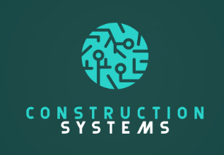
</p>
<b>Nuestra Marca</b><br>
Nuestro producto busca ayudar a empresas encargadas de construcciones u otras actividades que necesitan reportar avances y necesiten de una vista general.<br>
<b>Nuestro Logo</b><br>
Presentamos un logo moderno con colores de tonos verdosos, que demuestran equilibrio y calma. Esto para poder brindar seguridad al cliente y también mostrar que queremos evitar apuros u otros inconvenientes que afecten las fechas de entrega de los proyectos que administramos.<br>
<b>Paleta de colores</b><br>
En la paleta de colores tenemos los dos colores principales de tono verdoso, y además agregamos los dos básicos: negro y blanco. Además, agregamos dos tonos más pastel de los tonos verdes principales.

<p align= Center>
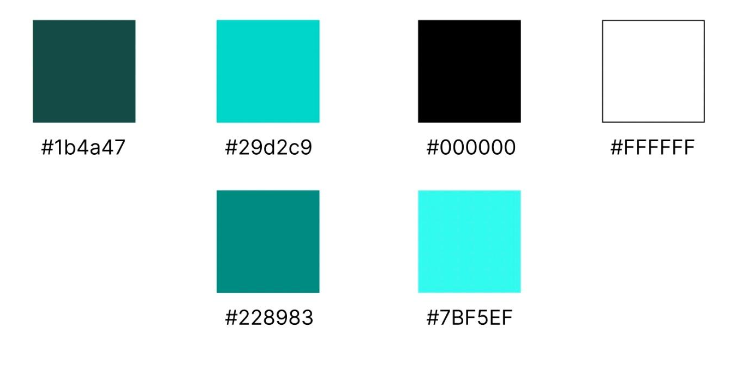
</p>
<b>Nuestra Tipografía</b><br>
Hemos seleccionado la fuente Helvética por ser una de las más utilizadas para que el usuario se sienta familiarizado al leer los diferentes contenidos de nuestros productos, ya sea el Landing Page o la Aplicación Web en sí.
<br>
<p align= Center>
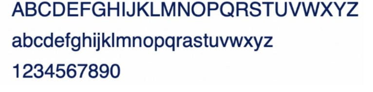
</p>

### 4.1.2. Web Style Guidelines


## 4.2. Information Architechture

### 4.2.1. Organization Systems
En esta sección el equipo explica en qué grupos de información aplicará cuáles son los sistemas de organización.
<b>Jerarquía Visual:</b>
 
Con el propósito de mantener la estética de nuestra plataforma creativa y a la vanguardia de la competencia actual, hemos decidido priorizar los siguientes principios de diseño y visualización.
 
<b>Jerarquía de Tipografía: </b>
Nuestra plataforma difunde diversa información que es recibida por nuestros usuarios con un orden específico según la demanda. Por lo tanto, es importante tener en cuenta las características con las que se generan nuestros títulos, subtítulos, párrafos, entre otros.
 
<b>Alineación:</b>
En nuestra plataforma, nuestras imágenes y botones se encuentran alineados siempre de manera vertical y horizontal. Permitiendo así agrupar varios objetos de diversos tipos con la misma información.
 
<b>Color y Contraste:</b>
A la vista del usuario, el color cumple un rol muy importante y nuestra plataforma promueve las correctas composiciones del color, para dirigir diversas emociones; y del contraste, para enfatizar aquellos objetos de mayor importancia.
 
<b>Organización Secuencial:</b>
Además, los métodos de almacenamiento sobre los registros que el usuario final emplea siguen una organización secuencial, esto con el objetivo de mejorar la simplicidad y la rapidez con la que se almacenan y acceden a ellos.
 
<b>Esquemas de categorización de contenido:</b>
Construction Systems contiene diferentes métodos de presentación de contenidos, ya que se recopilan distintas fuentes de información. Una de las categorías dedicadas es: por proyectos, donde se muestran los proyectos de Construction Systems,.


### 4.2.2. Labeling Systems
Tenemos cuatro headings, ubicadas en el tope, que tienen la sección projects, messages, settings.
 
<b>Projects:</b> Mostramos información de nuestros proyectos realizados.
 
<b>Messages:</b> Se muestra un canal de comunicación ante el usuario.
 
<b>Settings:</b> Se muestra las opciones donde el usuario pueda configurar a su justo.

Escogimos y colocamos estas en orden jerárquico y lo hemos presentado de esta forma para brindar a nuestros usuarios, la simplicidad de un landing page para encontrar información sobre nuestro servicio que brindamos.


### 4.2.3. SEO Tags and Meta Tags

### 4.2.4. Searching Systems
En esta sección el equipo explica qué medios de ayuda se brindará al usuario para la búsqueda de datos dentro del producto digital.
 
Los usuarios podrán buscar dentro de los 2 apartados que tenemos la información necesaria sobre nuestros proyectos y el canal de mensaje que brindamos. Nosotros le mandaremos recomendaciones de lo que busca en nuestra aplicación Construction Systems. Donde podrá tener toda la información que necesite.


### 4.2.5. Navigation Systems
Como se mencionó, nuestro landing page está dividido en 3 headings, entre ellos Projects, Messages y Settings.
En la sección “Projects” damos información de nuestros proyectos realizados, “Messages” muestra un canal donde exista una comunicación ante los usuarios, en “Settings”.

## 4.3. Landing Page UI Design

### 4.3.1. Landing Page Wireframe

### 4.3.2. Landing Page Mock-Up

## 4.4. Web Applications UX/UI Design

### 4.4.1. Web Applications Wireframes
<p align= Center>
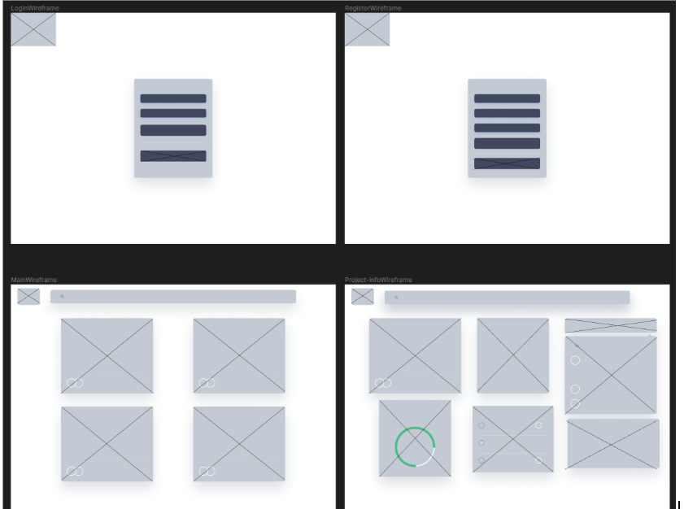
</p>
<p align= Center>
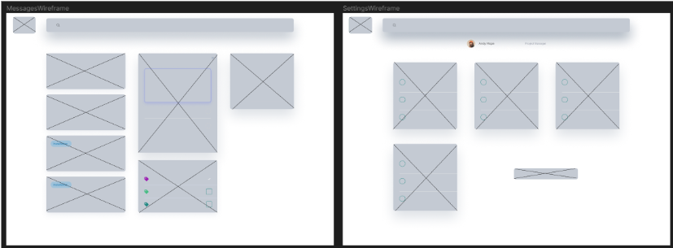
</p>

### 4.4.2. Web Applications Wireflow Diagrams

### 4.4.3. Web Applications Mock-Ups

<p align= Center>
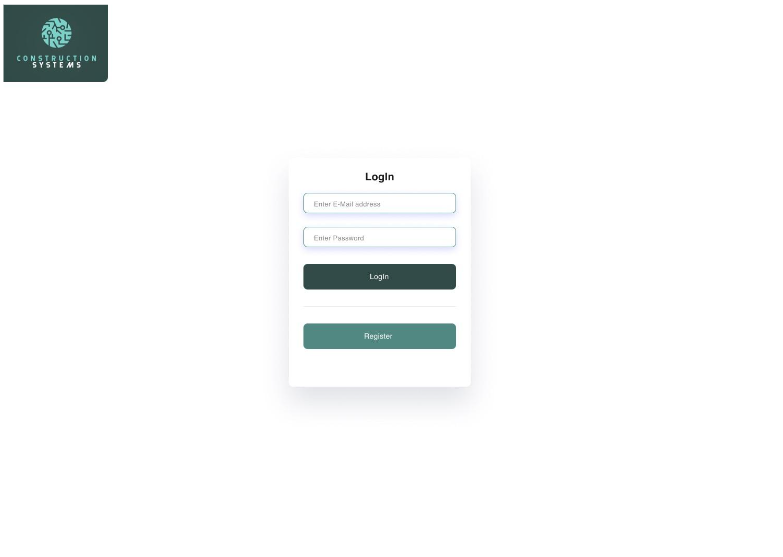
</p>
<p align= Center>
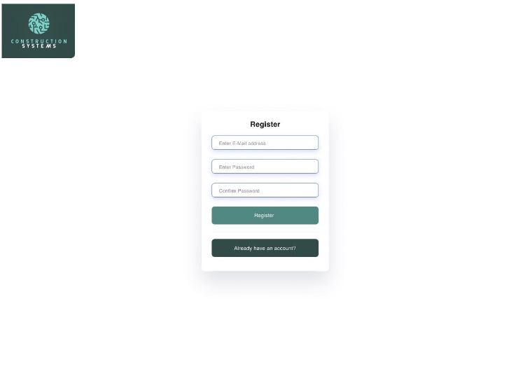
</p>
<p align= Center>
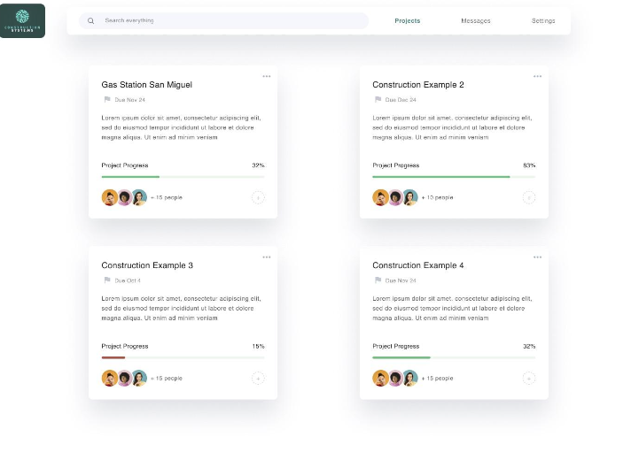
</p>
<p align= Center>
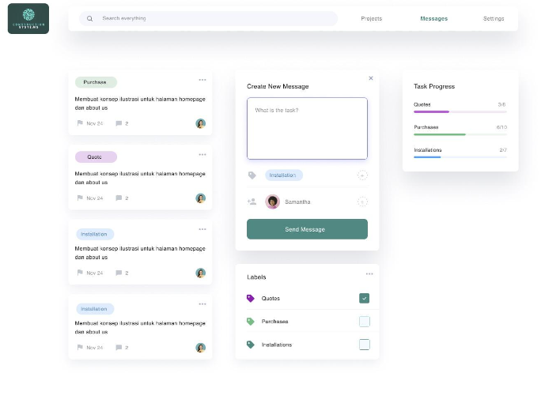
</p>
<p align= Center>
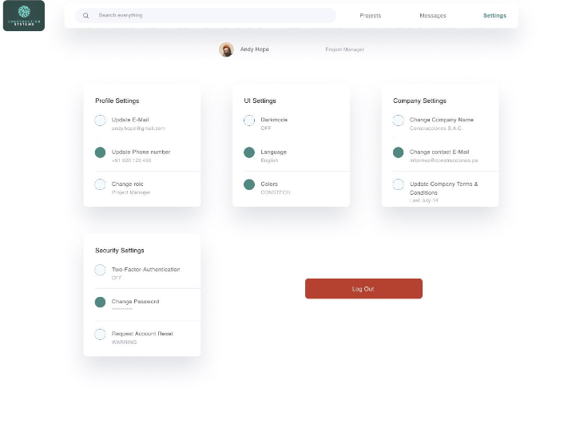
</p>

### 4.4.4. Web Applications User Flow Diagrams
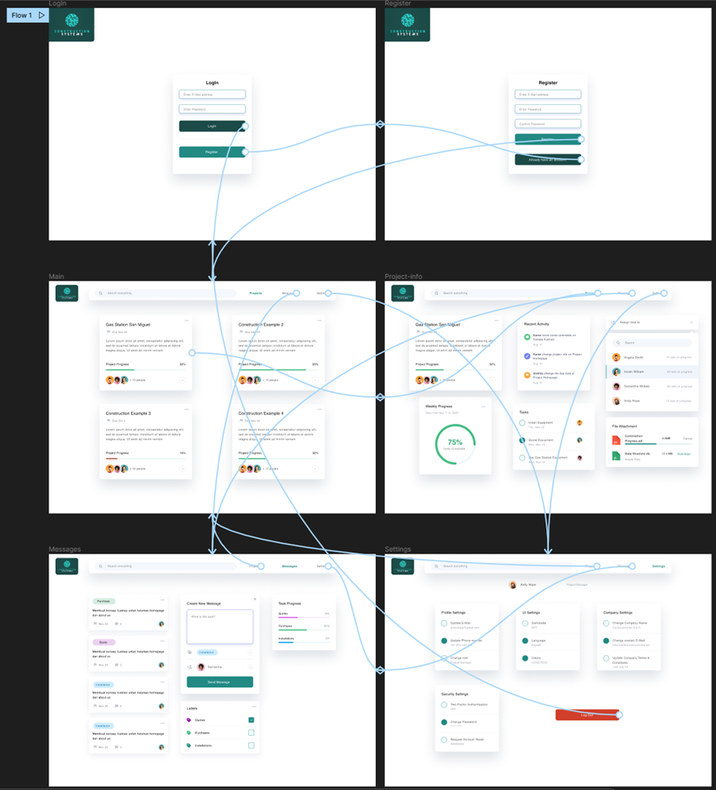
## 4.5. Web Applications Prototyping
Microsoft Stream Prototype Video Link: https://web.microsoftstream.com/video/368499d6-1582-4bb1-9e4c-93daf05793a7 

## 4.6. Domain-Driven Software Architecture
Como parte del proceso de arquitectura de Construction Systems, se ha utilizado los diagramas C4 para este propósito, a continuación, se presenta la organización del sistema a través de este sistema.


### 4.6.1. Software Architecture Context Diagram
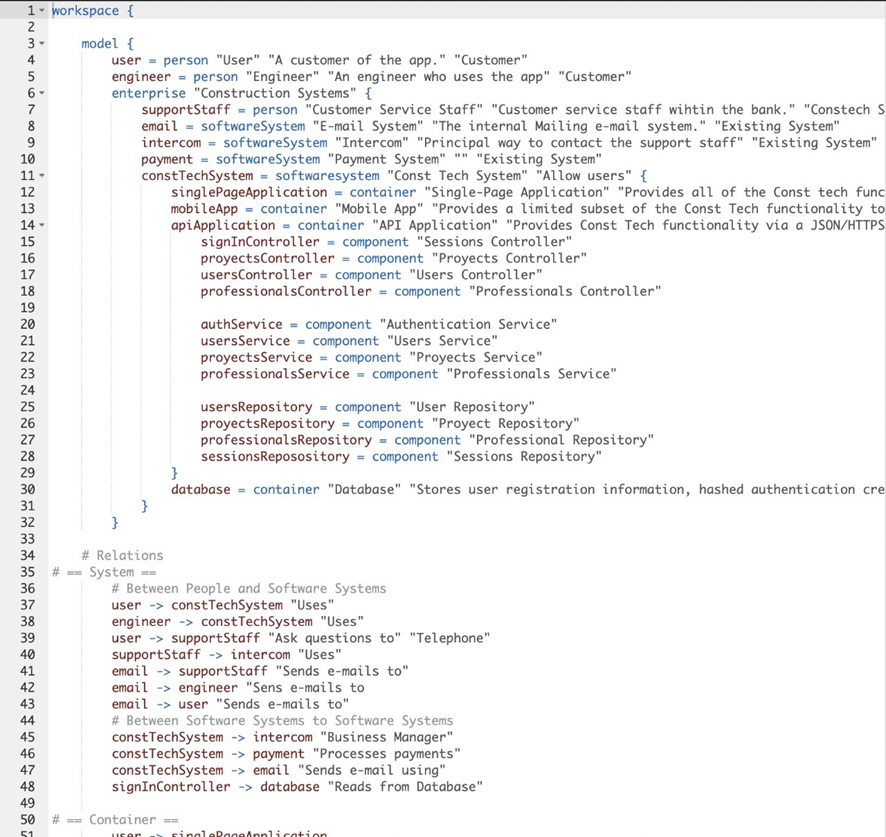

### 4.6.2. Software Architecture Container Diagrams
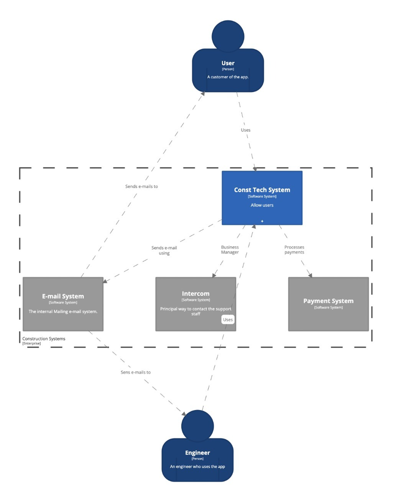
### 4.6.3. Software Architecture Components Diagrams
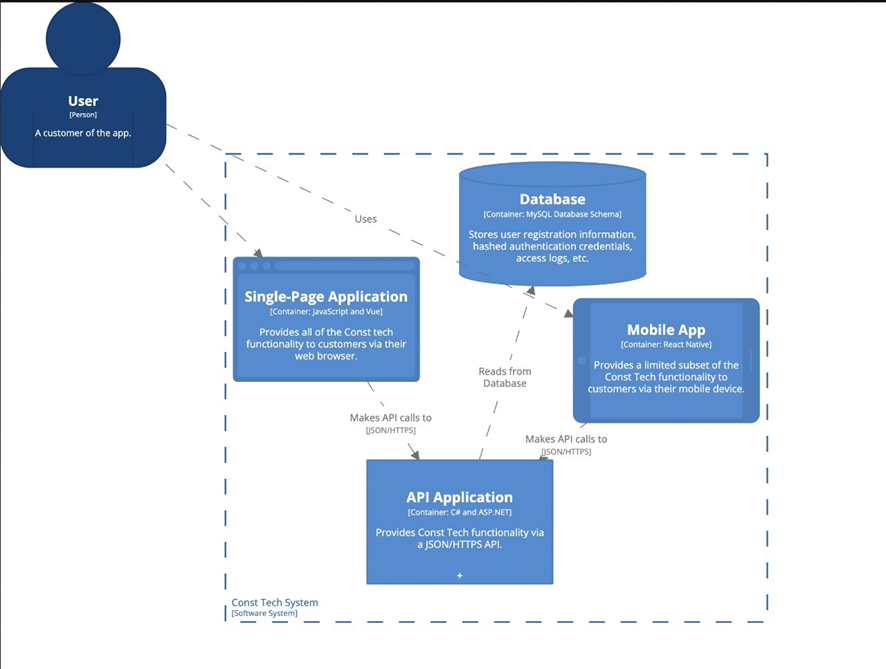
## 4.7. Software Object-Oriented Design

### 4.7.1. Class Diagrams
Este es el diagrama de clases realizado para construir nuestra aplicación. El diagrama fue creado mediante Lucid Chart.

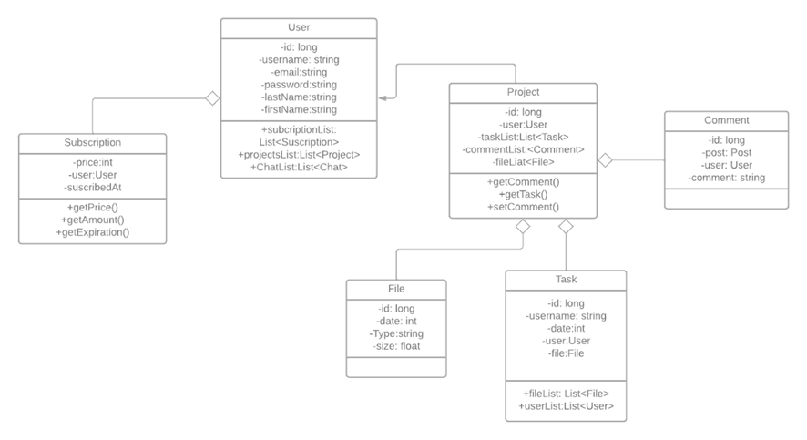

### 4.7.2. Class Dictionary
En el presente diccionario, se mostrará la utilidad de las clases creadas en el diagrama de clases presentado anteriormente
<b>User:</b> Esta clase es la encargada de almacenar toda la información del cliente, además de obtener toda la información respecto a las demás clases mediante listas.
<b>Subscription:</b> Clase relacionada por agregación a la clase User. Encargada de obtener información de la suscripción realizada por otros usuarios hacia ti y en la clase User los almacena en listas
<b>Project:</b> Clase que representa la entidad Proyecto. Encargada de almacenar los proyectos generados por los usuarios, en donde se tendrá una lista de comentarios, tareas y archivos que se generen durante el trabajo del usuario.
<b>Comment:</b> Clase que representa la entidad Comment. Encargada de almacenar un comentario generado en los proyectos, cuando se haga alguna modificación. Estos solo pueden existir en un solo un proyecto.
<b>Task:</b> Clase que representa la entidad Task. Encargada de almacenar  tareas que se generan en un proyecto, indicará cuando se complete alguna tarea.
<b>File:</b> Clase que representa la entidad File. Encargada de almacenar archivos que se suban en los proyectos, se podrá visualizar la fecha y el tipo de archivo que se sube. 

## 4.8. Database Design
A continuación, se muestra el diagrama de base de datos en base a nuestro diagrama UML, se respetó las relaciones y el uso del Primary y Foreign Key.


### 4.8.1. Database Diagram

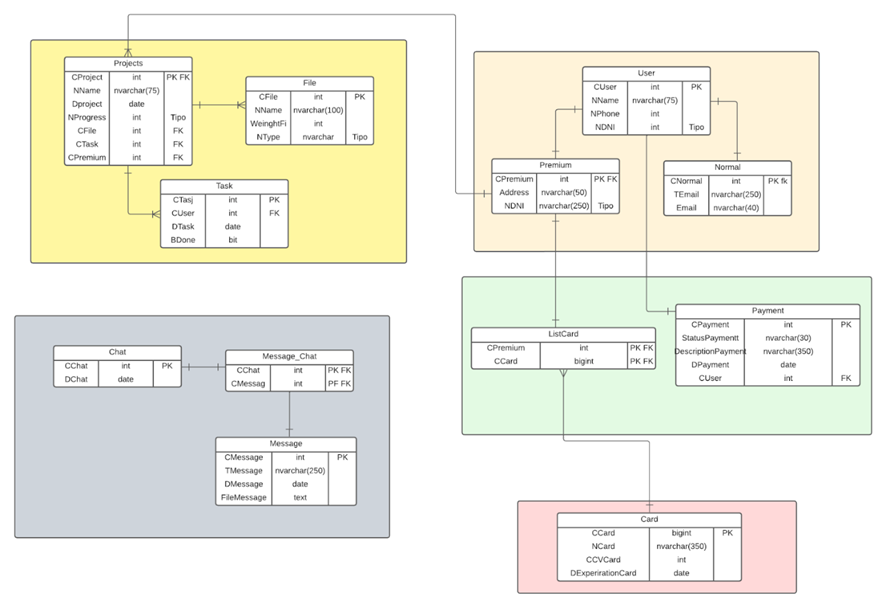

<div style="page-break-after: always;"></div>

# Capítulo 5: Product Implementation, Validation & Deployment

## 5.1. Software Configuration Management

| **Landing Page** | **Backend** | **Frontend** |
|------------------|------------|--------------|

Project Management

Para organizar nuestras tareas y mantener un registro de lo pendiente y lo completado, hemos utilizado Google Drive como nuestro centro principal de organización. Además, hemos empleado la herramienta Trello para establecer hitos y plazos que nos ayuden a llevar un seguimiento más detallado de nuestras tareas. En casos de consultas o dudas, realizamos llamadas grupales utilizando Teams.

Requirements Management

Para garantizar la calidad y la coherencia en nuestro proyecto, cada estudiante responsable de una parte designada somete su trabajo al criterio de todos. Esto implica una revisión conjunta y la sugerencia de posibles cambios con el objetivo de reducir o evitar errores antes de la presentación del proyecto.

Product UX/UI Design

En la etapa de diseño de producto, hemos empleado la herramienta Figma para crear wireframes de alta fidelidad y mockups. Además, utilizamos Figma para elaborar el prototipo de la aplicación web y móvil, asegurando así una experiencia de usuario óptima.

Software Development

Para la implementación de nuestro proyecto, hemos utilizado las siguientes tecnologías:
- C# (Backend)
- Vue.js (Frontend)

Software Deployment

Hemos optado por GitHub como plataforma de despliegue para nuestro landing page, lo que nos permite visualizar y probar la presentación de nuestro trabajo de manera interactiva.

Software Documentation

GitHub, una empresa sin fines de lucro, es nuestra elección para el almacenamiento en la nube de nuestros repositorios. En nuestro proyecto, GitHub potencia la colaboración entre los miembros del equipo, permitiéndonos trabajar con repositorios remotos que albergan los distintos proyectos del startup. Estos proyectos incluyen la Landing Page, la SPA (Aplicación de Página Única) y el Backend del servidor. Cada miembro del equipo se encarga de una parte específica del proyecto, lo que nos permite trabajar de manera modular y eficiente.

### 5.1.1. Software Development Environment Configuration. 

Despliegue de Landing Page

A continuación, se describen los pasos necesarios para el despliegue de un Landing Page:

**Paso 1: Preparación de Repositorio**

Asegúrate de que todos los archivos y carpetas necesarios estén disponibles en un repositorio de GitHub. Es importante priorizar el archivo `index.html`, ya que se reconocerá como el archivo principal para la ejecución del despliegue.

**Paso 2: Configuración de Deployment**

2.1. Accede a la configuración de tu repositorio en GitHub.
2.2. Navega hasta la sección "Settings" (Configuración).
2.3. En el menú lateral, selecciona "Pages" (Páginas).

**Paso 3: Especificación de la Rama**

3.1. En la sección de "GitHub Pages," busca la opción para especificar la rama del proyecto que deseas desplegar. Puede ser la rama principal o la rama específica que contiene tu Landing Page.
3.2. Selecciona la rama adecuada en el menú desplegable.

**Paso 4: Guardar la Configuración**

4.1. Asegúrate de haber guardado los cambios realizados en la configuración. Es posible que debas buscar un botón o enlace con la etiqueta "Save" (Guardar).
4.2. Una vez que hayas guardado la configuración, espera a que el sistema realice el despliegue automáticamente.

Con estos pasos, habrás configurado correctamente el despliegue de tu Landing Page en GitHub Pages. El sitio estará disponible públicamente en la dirección proporcionada por GitHub, y podrás acceder a él una vez que el proceso de despliegue se haya completado.
### 5.1.2. Source Code Management.

Para implementar el flujo de trabajo GitFlow utilizando la herramienta de control de versiones Git, nos basamos en la entrada de blog titulada "A successful Git branching model" de Vincent Driessen. Esta fuente nos proporcionó las siguientes convenciones que serán aplicadas en nuestro proyecto:

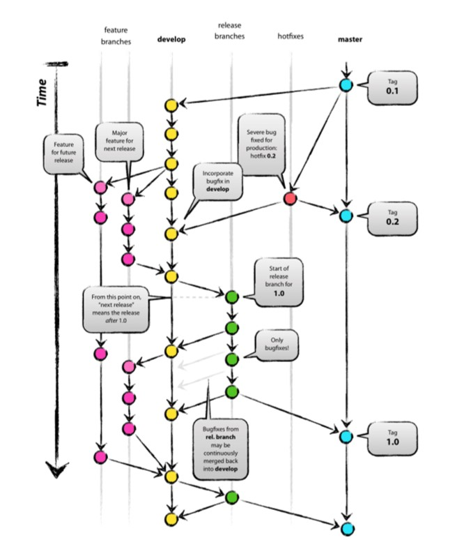

### 5.1.3. Source Code Style Guide & Conventions.

**Semantic Versioning**

Las siguientes convenciones de nombramiento de versiones se basaron en el artículo Semantic Versioning 2.0.0 como referencia:

- Cada número de versión debe seguir el formato X.Y.Z, compuesto únicamente por números enteros no negativos. Donde X representa la versión principal, Y la versión secundaria, y Z la versión de parche.
- La versión inicial debe tener el formato 0.X.Y.
- La versión de parche Z debe incrementarse solo si se corrigen errores compatibles con versiones anteriores.
- La versión secundaria Y debe aumentar cuando se introduce una nueva funcionalidad compatible con versiones anteriores o se realizan mejoras en el código privado. También puede incluir cambios en la versión de parche, pero cada vez que se incremente la versión secundaria, la versión de parche debe reiniciarse a 0.
- La versión principal X debe incrementarse cuando se introducen funcionalidades incompatibles con versiones anteriores. También es posible realizar algunos cambios y correcciones en el nivel de parche. En este caso, tanto la versión de parche como la versión secundaria deben reiniciarse a 0.

**Conventional Commits**

Para las convenciones de los commits, nos basamos en el artículo Conventional Commits 1.0.0. Se debe seguir la siguiente estructura para un commit:

```bash
git commit -m "<type>[optional scope]: <title>" -m "<description>"
```

Tipos:

- `add`: Usado para indicar la adición de archivos o carpetas.
- `fix`: Utilizado para confirmar la corrección de errores en el código.
- `feat`: Se emplea cuando se agrega una nueva funcionalidad.
- `test`: Indica la adición de archivos de prueba.
- `BREAKING CHANGE`: Se utiliza para confirmar cambios importantes en el código.

El campo `[optional scope]` se utiliza únicamente en las ramas `release`, `hotfix`, y `master` para indicar la versión del producto.

HTML

Para las convenciones de HTML, se recomienda:

- Utilizar nombres en minúsculas para los elementos HTML.
- Cerrar todos los elementos HTML.
- Usar minúsculas para los nombres de atributos HTML.
- Siempre especificar `alt`, `width`, y `height` para las imágenes.
- Evitar espacios y signos de igual entre las entidades HTML.
- Separar palabras en ID y clases con guiones.
- Colocar las declaraciones en orden alfabético.
- Separar selectores y declaraciones en nuevas líneas.

Para obtener más información sobre las convenciones de HTML, puedes consultar [este enlace](https://www.w3schools.com/html/html5_syntax.asp).

CSS

Para las convenciones de CSS, se recomienda:

- Usar nombres significativos para clases y ID que reflejen el propósito del elemento.
- Utilizar nombres cortos pero descriptivos para ID y clases.
- Emplear propiedades CSS abreviadas siempre que sea posible.
- Evitar unidades después de usar 0 en valores que lo requieran.
- Separar palabras en ID y clases con guiones.
- Colocar las declaraciones en orden alfabético.
- Separar selectores y declaraciones en nuevas líneas.

Puedes obtener más información sobre las convenciones de CSS en [este enlace](https://google.github.io/styleguide/htmlcssguide.html#CSS).

JavaScript

En JavaScript, se recomienda:

- Usar la sintaxis expandida con llaves de apertura y cierre en líneas separadas.
- Utilizar `lowerCamelCase` para nombrar variables.
- Declarar variables con `let` y `const`, evitando `var`.
- Usar siempre la igualdad estricta.
- Nombrar funciones con `lowerCamelCase`.
- Crear objetos utilizando literales de objetos.
- Usar la sintaxis de clase de ES para definir clases.
- Crear arrays utilizando literales de arrays.

Puedes obtener más detalles sobre las convenciones de JavaScript en [este enlace](https://developer.mozilla.org/en-US/docs/MDN/Guidelines/Code_guidelines/JavaScript#creating_arrays).

TypeScript

En TypeScript, se sugiere:

- No usar el modificador `public` al declarar atributos, funciones o métodos públicos.
- Siempre utilizar paréntesis al llamar a constructores, incluso si no reciben parámetros.
- Evitar campos privados y en su lugar utilizar anotaciones de visibilidad de TypeScript.
- Usar getters y setters para controlar la visibilidad de los detalles de implementación internos.
- No usar el constructor `Array()`, en su lugar, utilizar notación de corchetes o `Array.from()`.

Puedes obtener más información sobre las convenciones de TypeScript en la [documentación de TypeScript](https://www.typescriptlang.org/docs/handbook/declaration-files/by-example.html).

**Gherkin:**

| **Sintaxis** | **Propósito** |
|--------------|---------------|
| `FEATURE`    | Proporciona una descripción de alto nivel de una función de software y agrupa SCENARIOs relacionados. |
| `SCENARIO` o `EXAMPLE` | Ejemplo concreto que contiene una regla de negocio y sigue el patrón 'Given-When-Then'. |
| `GIVEN`      | Describe el contexto inicial del sistema, estableciendo el escenario del escenario. Su propósito es configurar el sistema en un estado concreto antes de que el usuario o sistema externo interactúe con él. |
| `WHEN`       | Describe un evento o acción que ocurre en el sistema, ya sea a través de la interacción del usuario o desencadenado por otro sistema. |
| `THEN`       | Describe el resultado esperado del escenario y utiliza aserciones para comparar el resultado real con el resultado esperado. |
| `AND`        | Se utiliza para agregar condiciones adicionales en cualquier parte de los patrones `Given`, `When` o `Then`. |
| `BUT`        | Similar a `AND`, se usa para agregar condiciones adicionales en los patrones `Given`, `When` o `Then`. |
| `BACKGROUND` | Utilizado cuando se repiten los mismos `GIVEN` en muchos `SCENARIOs` de una `FEATURE`. Permite agruparlos en un contexto común para evitar repeticiones innecesarias. |


### 5.1.4. Software Deployment Configuration.
Para llevar a cabo el desarrollo del proyecto, hemos empleado una variedad de herramientas que desempeñan roles específicos en la creación de diferentes secciones de este informe. A continuación, proporcionamos los nombres de los programas utilizados y su función:

1. **Miro**: Utilizamos Miro para elaborar el Lean UX Canvas presentado en el capítulo 1 del informe.
   - Enlace: [Miro](https://miro.com/)

2. **UXPressia**: Esta herramienta se empleó para crear elementos como User Personas, Impact Maps, Empathy Maps y Journey Maps.
   - Enlace: [UXPressia](https://uxpressia.com/)

3. **Trello**: Trello fue nuestra elección para mantener actualizado el estado de cada tarea dentro de los Sprint.
   - Enlace: [Trello](https://trello.com/es)

4. **Lucidchart**: Utilizamos Lucidchart para la creación de Diagramas de Clase, Base de Datos, User Flows y Wireflows.
   - Enlace: [Lucidchart](https://www.lucidchart.com/pages/)

5. **Structurizr**: Esta herramienta se utilizó para crear los diagramas del Modelo C4, como el Diagrama de Contexto, el Diagrama de Contenedores y los Diagramas de Componentes.
   - Enlace: [Structurizr](https://structurizr.com/)

6. **Visual Studio Code**: Este editor de código fue fundamental para la primera versión del Landing Page.
   - Enlace: [Visual Studio Code](https://code.visualstudio.com/)

7. **IntelliJ IDEA**: Utilizamos IntelliJ IDEA para desarrollar la parte de Back-end de Legiz.
   - Enlace: [IntelliJ IDEA](https://www.jetbrains.com/es-es/idea/)

8. **WebStorm**: WebStorm se empleó para crear el Front-end y el Landing Page de Legiz.
   - Enlace: [WebStorm](https://www.jetbrains.com/es-es/webstorm/)

9. **Git**: Utilizamos Git para el control de versiones en conjunto con GitHub.
   - Enlace: [Git](https://git-scm.com/)

10. **Jenkins**: Esta herramienta se utilizará para implementar el pipeline de integración continua.
    - Enlace: [Jenkins](https://www.jenkins.io/)

11. **JUnit**: JUnit será nuestro framework para llevar a cabo pruebas unitarias en el proyecto.
    - Enlace: [JUnit](https://junit.org/junit5/)


## 5.2. Landing Page, Services & Applications Implementation. 
Para llevar a cabo la implementación del landing page, optamos por GitHub Pages, que en conjunto consideramos como una opción simple y de fácil implementación. Creamos un repositorio que contiene todos los elementos con los que trabajaremos.

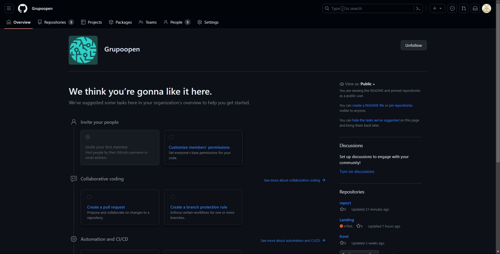


Después procedimos a elaborar el código y posteriormente lo cargamos en GitHub para su posterior lanzamiento.

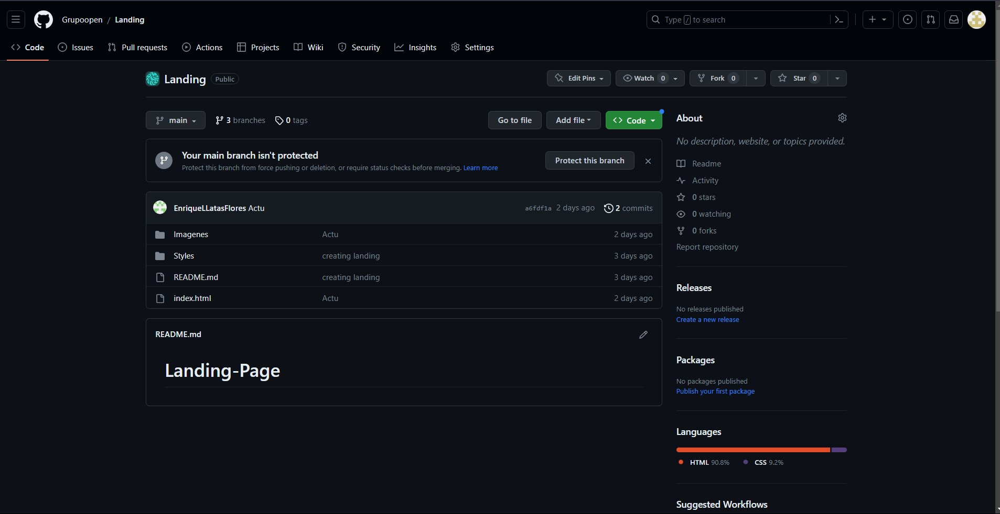

Teniendo en el index el código del landing page

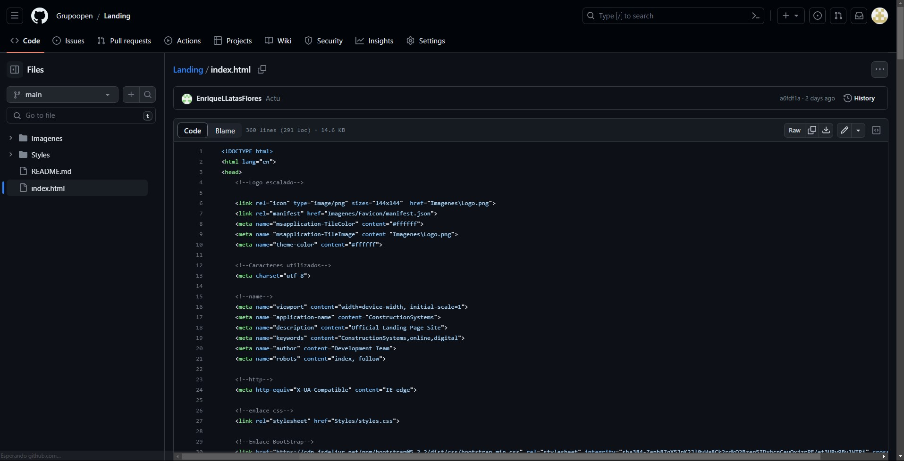
### 5.2.1. Sprint 1
#### 5.2.1.1. Sprint Planning 1

#### 5.2.1.2. Sprint Backlog 1

| **Sprint #** | **Sprint 1** |
|--------------|--------------|
| **User Story** | **Work-Item / Task** |
| **id** | **Title** |
| WI01 | Desarrollo de la sección "Colaboradores" |
| **Description** | **Estimation** |
| Desarrollo de la implementación del código de la sección "Colaboradores" para el landing page | 3 horas |
| **Assigned To** | **Status** |
| CSLP | Done |
| **id** | **Title** |
| WI02 | Desarrollo de la sección Home del landing page |
| **Description** | **Estimation** |
| Desarrollo de la implementación del código para la sección "Home" del landing page | 3 horas |
| **Assigned To** | **Status** |
| CSLP | Done |
| **id** | **Title** |
| WI03 | Desarrollo de la sección community |
| **Description** | **Estimation** |
| Desarrollo de la implementación del código para la sección de "community" del landing page | 6 horas |
| **Assigned To** | **Status** |
| CSLP | Done |
| **id** | **Title** |
| WI04 | Desarrollo de la sección Blog |
| **Description** | **Estimation** |
| Desarrollo de la implementación del código para la sección de "Blog" en el landing page | 8 horas |
| **Assigned To** | **Status** |
| CSLP | Done |
| **id** | **Title** |
| WI05 | Desarrollo de la sección events |
| **Description** | **Estimation** |
| Desarrollo de la implementación del código para la sección de eventos en el landing page | 6 horas |
| **Assigned To** | **Status** |
| CSLP | Done |
| **id** | **Title** |
| WI06 | Desarrollo del botón de login en el header |
| **Description** | **Estimation** |
| Desarrollo del botón de login que permitirá entrar a la aplicación web | 3 horas |
| **Assigned To** | **Status** |
| CLSP | Done |
#### 5.2.1.3. Development Evidence for Spring Review
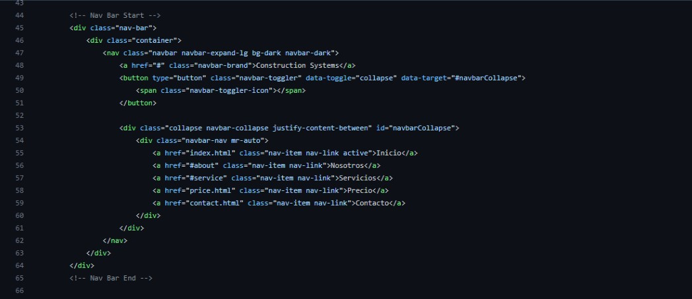
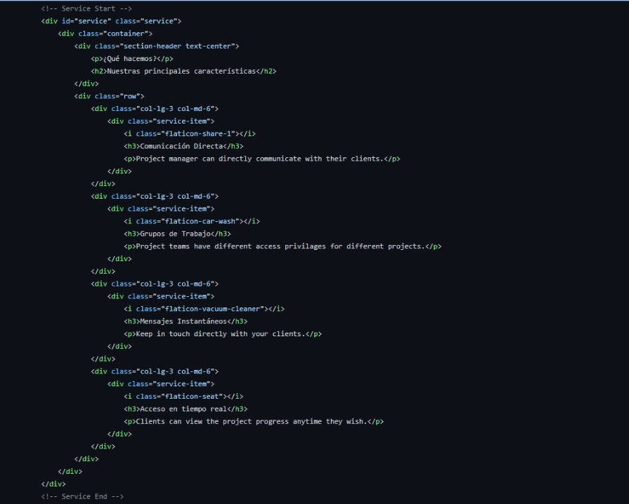
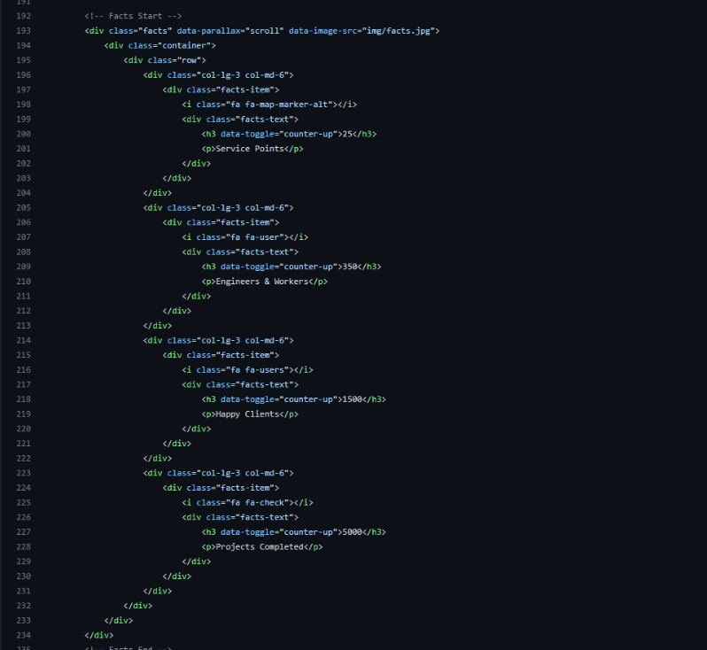
#### 5.2.1.4. Testing Suite Evidence for Sprint Review
En esta primera entrega del primer sprint, nos complace informar que hemos logrado completar todas las tareas requeridas, incluyendo la implementación de algunos user stories relacionados con el frontend. Esto demuestra un sólido progreso en el desarrollo del proyecto y refleja nuestro compromiso en cumplir con los objetivos establecidos. Estamos satisfechos con los logros alcanzados hasta el momento y estamos ansiosos por continuar avanzando en los siguientes sprints.

#### 5.2.1.5. Execution Evidence for Sprint Review
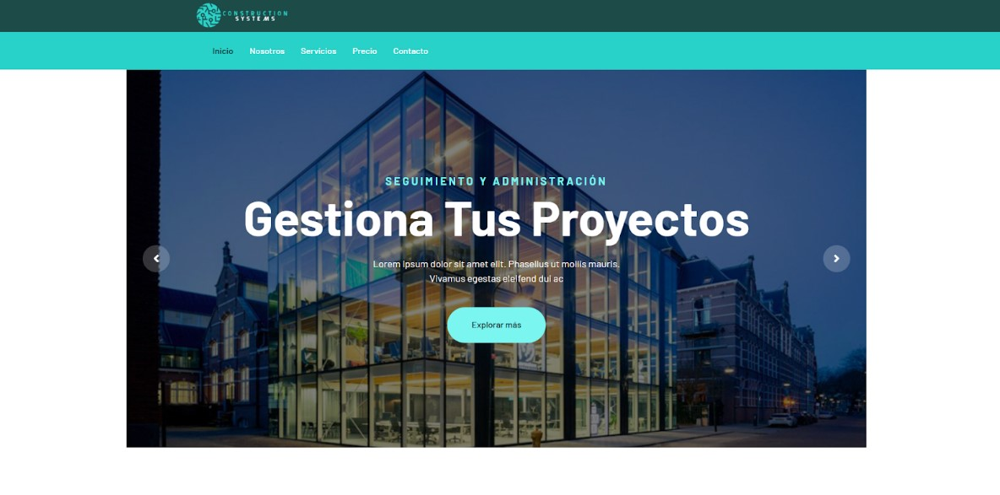
#### 5.2.1.6. Services Documentation Evidence for Sprint Review
El desarrollo del landing page se llevó a cabo utilizando la herramienta WebStorm y se implementaron tecnologías web estándar como HTML, CSS y JavaScript. Además, optamos por utilizar GitHub para alojar y publicar la versión final de nuestro proyecto, que está disponible en el siguiente enlace: https://construction-systems.github.io/landing/.

Este enlace permite que cualquier persona acceda y explore nuestro landing page en línea, lo que facilita la visualización y evaluación de nuestro trabajo por parte de los usuarios. Continuaremos trabajando en nuestro proyecto y estamos disponibles para cualquier pregunta o asistencia adicional que puedan necesitar.
#### 5.2.1.7. Software Deployment Evidence for Sprint Review

#### 5.2.1.8. Team Collaboration Insights during Sprint

## 5.3. Validation Interviews.

### 5.3.1. Diseño de Entrevistas.

### 5.3.2. Registro de Entrevistas.

### 5.3.3. Evaluaciones según heurísticas. 

## 5.4. Video About-the-Product.


<div style="page-break-after: always;"></div>

# Conclusiones

## Conclusiones y recomendaciones

## Video About-the-Team


<div style="page-break-after: always;"></div>

# Bibliografía


<div style="page-break-after: always;"></div>

# Anexos
